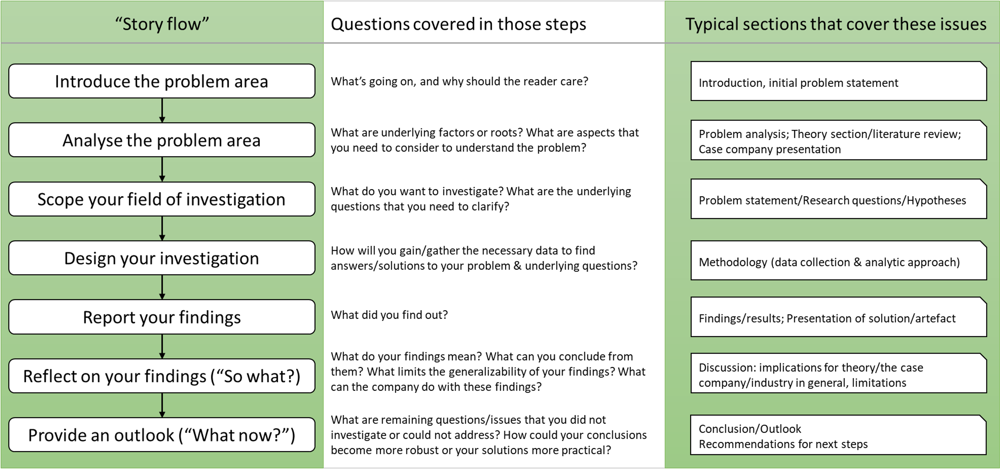

# Guide for report writing

Author: *Verena Stingl*

## Structuring your report

While there are many ways to structure your report, there is typically
an underlying logic related to how you "tell a compelling story" in
any of these reports. The typical story flow is the following:

## General recommendations

-   *A report is not a mystery novel*. Never leave the reader wondering
    why they are reading about some topic or why they should care.
    That means:

 -   Start your report on point with introducing the specific problem
        area, and what makes that area problematic. E.g. *"Day-to-day delivery operations operate under high fluctuations in demand. This variability creates challenges for both efficient stock keeping and staff planning, when actual needs are known less than 24h before they should be met."*

 -   Give an outlook how you will help understand and overcome the
        challenge, i.e. what the reader can expect to get out of this
        report.

 -   When you introduce a new section or theme, tell the reader why
        this is important - especially in the "literature" or
        "theory" section. E.g. *"Day-to-day delivery operations can cope with demand fluctuation through three approaches: improving forecasts, working with buffers, or increasing flexibility in their processes. In the following we are introducing these three approaches and under which condition they are sensible strategies, and thereafter will discuss them in the context of our case company."*

## Define your golden thread (rød tråd)
This should ideally be done before starting detail writing
and make sure that it does not make twists and loops. A report
should have a clear argumentative structure, that means:

 -   If a section does not help the reader to understand better what
        the problem is, what you did to tackle it, or what your
        problem solution really is, it probably has no place in the
        report.

 -   If a section requires knowledge from later in the report to be
        understandable, it is probably badly placed

 -   If you cannot formulate a conclusion regarding the current
        section that will build a bridge to what you will tell in the
        next section(s), it is probably not necessary to have that
        section.

 -   If a section repeats what has been written earlier in the
        report, you should probably cut down on the redundancies

## Create signposts

It is massively helpful for the flow of the text
to start a section with a purpose statement, and conclude it with
some sort of summary. However, there are good and bad ways to do
it.

Good ways to start provide the reader with a frame in which they can
"mentally" place the details provided later in the section. Bad ways
just state the obvious and take up space. For example:

-   BAD way to start a section: *"The purpose of this section is to
    introduce the methodology and give an overview of the collected
    data."* does not tell you anything that a section header could
    have implied; does not connect to what has been written before.

-   GOOD way to start a section: *"To investigate this problem further, we relied on a combination of qualitative and quantitative data collection methods that provided insights on the current warehousing practices. Specifically we..."* $\rightarrow$ links to the previous
    section (i.e. the problem introduced before), gives an outlook on
    what will be covered ("qualitative and quantitative data collection methods") and why this is relevant (to understand more
    about the current warehousing practices).

Good ways to end provide the reader with a reminder of the most
important points of the section, and how it relates both to the
general theme and to what will come after. Bad ways, again, just state
the obvious and take up space. For example:

-   BAD way to end a section: *"In this section we have presented the theory on forecasting, buffering, and flexible process design."*
    $\rightarrow$ tells nothing more than a section heading would have told you.
    Does not build a bridge to the next section.

-   GOOD way to end a section: *"Each of the discussed approaches for dealing with demand fluctuation comes with specific advantages and disadvantages that are dependent on the context of the organization. In the following section we will discuss how these approaches could be relevant for the case of [case company]."* $\rightarrow$
    Highlights what the important points of the theory section were
    (applicability of the different approaches is dependent on
    context) and links to whats coming next (using the newly build
    understanding of which approach can succeed where to analyse the
    options of the case company)

## Use precise and professional language

Colloquialisms can take
attention away from otherwise thorough work and can make the report
appear unprofessional. A great resource for finding the right words
is the "Academic Phrasebank" by Manchester University:
<https://www.phrasebank.manchester.ac.uk/>

## Make convincing claims

Especially in the introduction, you have
to make claims about the case company or the industry that they are
working in, for example regarding trends, or specific challenges or
problems. In this section you want to persuade the reader that they
should care, so make sure that your claims are convincing and
specific (e.g. by using numbers or quotes instead of mere
descriptions and by referencing to trustworthy sources). For
example:

 -   Unconvincing claim: "*Demand in construction material has skyrocketed*" What does "skyrocket" mean? Where and when has
        demand increased? What's covered by construction material?

 -   Convincing claim: "*Due to increased home renovations during the Corona pandemic, the demand for construction material in Denmark has increased by X% (of sales volume in DKK) in Q1 2021 compared to Q1 2020 (REFERENCE TO SOURCE). While all types of construction material have seen a rise in demand, the groups [material 1], [material 2] and [material 3] have had the highest increase by X%, Y%, and Z%."*

 -   Unconvincing claim: *"The most important aspect to manage when introducing green policies are social issues"* What is meant by "social issues" and "green policies"? Who does the managing? Why exactly is it important (and more so than other aspects)?

 -   Convincing claim: *"To reduce overall green-house gas emissions within a society, policies need to address technological, economic, and social issues (REFERENCE TO RELIABLE SOURCE). Social issues here refer to the potential (negative) consequences of these policies for some groups within society, or all people in society. Fears of such negative consequences could trigger substantial civil opposition to these policies, even as technological solutions become increasingly available. Acknowledging this risk, EU commission's vice-president Frans Timmermans recently stated in an interview with the Guardian*
'[We] should make the social issue the pivotal issue in all of this. [..] This could become the biggest stumbling block' *(REFERENCE TO INTERVIEW)."*

## Filling the pages is not the goal

You will not be given a higher grade for filling all of your allocated pages with pointless text. You will also not be penalised if you can get your message across clearly in fewer pages.

## Don't try to save the world

You only need to address one well-scoped problem, and address it in a manner that
is reasonable in relation to your time and skill. Thus, you will
have to make decisions on what aspects of the problem area you
focus on, and which areas you will not tackle in your project.

Similar you will make decisions regarding which solution paths to
follow and which to abandon. Clearly articulate your decisions,
mention briefly those aspects/solutions that you are aware of but
have decided not to investigate (either in the problem definition
and/or in the discussion). Don't write long theoretical sections
on issues/approaches that were out of scope for you! For example:

 -   In the problem statement: *"There are a number of known barriers to the adoption of digital technologies in manufacturing, typically grouped as technical, structural, and cultural barriers [REFERENCE]. For this project, we focus only on technical barriers in our solution development. However, we will consider potential implications of structural and cultural barriers in the discussion of this report.*"

 -   Concluding the theory section: *"Advanced forecasting techniques can be a promising approach to manage demand fluctuation in context where [CONTEXTS WHERE IT WORKS]. However, as we have described in the company background, [case company]'s demand is driven by [DIFFERENT FACTORS]. Thus, we will focus instead on approaches related to increasing the process flexibility as an alternative approach to handle their daily demand fluctuations."*

 -   In the discussion: *"Our project has helped to identify the main technological barriers for the adoption of [technology X] in [case company]. We have made several propositions how to overcome these technological barriers in moving forward in their digitalization, such as [EXAMPLES]. However, our propositions have not yet considered structural and cultural barriers, such as the fit of the technology with current processes and business models, or potential fear of changes related to the digitalization. Thus, in developing implementation plans for these propositions, we advise [case company] to investigate into potential barriers related to their organizational structure and culture. Specifically, throughout our project, we have noted [... your thoughts on these other barriers]"*

## Reading & revising is just as important as writing

I will of
course read and comment on your report, but I will never go to the
detail level that you can provide to each other (and I will not
re-read sections on which I have commented earlier in the project).
So set time aside to read the sections of your colleagues (or assign
one or two of the group members the role of reviewer). Read
critically against questions such as:

 -   Is the golden thread (rød tråd) clear?

 -   Does the argument have a logical structure?

 -   Are the claims convincing?

 -   Is the language appropriate?

 -   Is there text that serves no purpose?

Then give constructive feedback -- be specific and give examples (and be
nice). For example:

-   *"In the second paragraph you introduce [Theme X] but it is a bit
    unclear how this connects to the paragraph before. Maybe you could
    add..."*

-   *"I remember we had a quote from the production manager, we could
    use it to strengthen the argument you make here.."*
