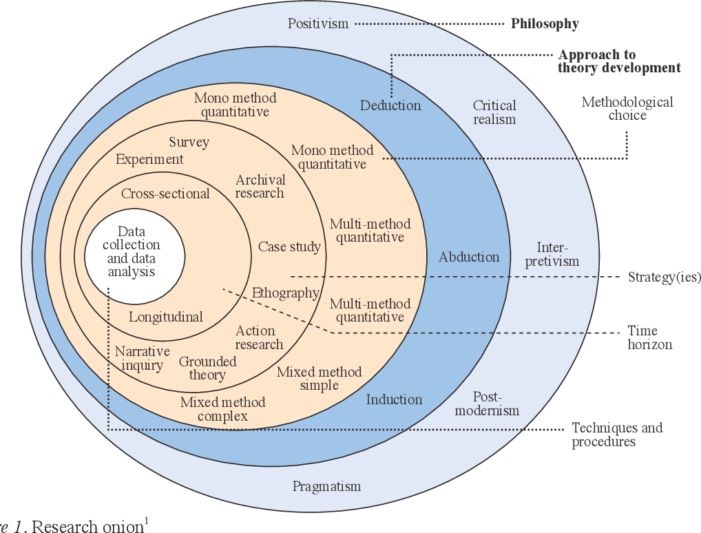

---
output:
  bookdown::gitbook:
    config:
      toc:
        collapse: section
  pdf_document:
    fig_caption: yes
    number_sections: yes
    keep_tex: yes
    dev: tikz
  html_document:
    df_print: paged
classoption: twoside
geometry: top = 25mm, left=25mm, right=25mm, bottom=25mm, paperwidth=170mm, paperheight=240mm
urlcolor: black
linkcolor: red
fontsize: 10pt
font-family: times
header-includes:
- \usepackage{placeins}
- \usepackage{fancyhdr}
- \usepackage{setspace}
- \onehalfspacing
- \usepackage{chngcntr}
- \counterwithin{figure}{section}
- \counterwithin{table}{section}
- \counterwithin{equation}{section}
- \counterwithin{footnote}{section}
- \usepackage{subfig}
- \usepackage{float}
- \usepackage{lscape}
- \newcommand{\blandscape}{\begin{landscape}}
- \newcommand{\elandscape}{\end{landscape}}
- \newcommand{\onlythepage}{\arabic{page}}
- \newcommand*{\secref}[1]{Section~\ref{#1}}
- \raggedbottom
- \renewcommand{\thepage}{(\thesection):\arabic{page}}
---

```{r global_options, include=FALSE}

sapply(c("reshape2", "quantmod", "Hmisc", "mFilter", "xtable", "plotrix", "networkD3",
         "Formula", "knitr", "reshape", "plm", "countrycode", "tidyr", "dplyr", "eurostat",
         "plyr", "foreign","ecb", "tidyverse", "stringr", "rstudioapi", "ggplot2", "corpcor",
         "perturb","data.table", "rowr", "statsDK", "date", "kableExtra",
         "readxl", "OECD", "viridis", "fpp", "rsdmx", "roll", "scales", "randomcoloR",
         "grid", "cowplot"), require, character.only = TRUE)

options(knitr.kable.NA = '', knitr.table.format = "latex")

#########################################################################
# Set knitr chunk options
#########################################################################

opts_chunk$set(fig.path = 'figures/',
               echo = FALSE, 
               message = FALSE, 
               warning = FALSE, 
               fig.align = "center", 
               fig.width = 5,
               fig.pos = 'H',
               as.is = TRUE,
               include = TRUE,
               cache = TRUE)

```


<!-- Remove the page number from the bottom of your title page -->

\pagenumbering{gobble}

<!-- ----------------------------Title Page---------------------------- -->
<!-- ----------------------------Title Page---------------------------- -->
<!-- ----------------------------Title Page---------------------------- -->

\begin{centering}

\vspace{2 cm}

\Large

{\bf Supervision Guide}

\vspace{2 cm}

\Large
Rob Smith

\vspace{2 cm}

\normalsize


\vspace{2 cm}

\normalsize
Guidelines for students under supervision

Spring 2020

\vspace{2 cm}

\normalsize
Aalborg University Business School

\normalsize
Aalborg University

\end{centering}

\newpage
<!-- ----------------------------End of title Page---------------------------- -->
<!-- ----------------------------End of title Page---------------------------- -->
<!-- ----------------------------End of title Page---------------------------- -->


<!-- Set the type of page - to allow for interesting headers and footers -->
<!-- Set the type of page - to allow for interesting headers and footers -->

\pagestyle{fancy}

<!-- Clear all of the positions of the headers and footers, LeftEven, RightOdd -->
<!-- Clear all of the positions of the headers and footers, LeftOdd, RightEven -->

\fancyhead[LE,RO]{}
\fancyhead[LO,RE]{}

<!-- Set a line below the header, and an invisible line above the footer -->
<!-- Set a line below the header, and an invisible line above the footer -->

\renewcommand{\headrulewidth}{0.4pt}
\renewcommand{\footrulewidth}{0pt}

<!-- Set the page numbering type for the initial pages of your project -->
<!-- Abstract, table of contents, acknowledgements etc -->

\pagenumbering{roman}

<!-- Create a barrier to stop LaTeX items from floating up above this point -->
<!-- Then start a new page -->

\FloatBarrier
\newpage

<!-- 1. Set the header for the top of the page -->
<!-- 2. Create a section header, but remove the numbering, so that it just shows up as a section -->
<!-- 3. When you remove the section numbering in this way you have to add the section to the table of contents -->
<!-- There is another example in the chapters that is simpler, using the "# Header {-}" structure -->


<!-- 1. Again, stop items from floating above this point -->

<!-- 2. This time, the new page option is changed to "cleardoublepage" -->
<!-- This will ensure that the section starts on an odd page number (not necessary) -->
<!-- This is mostly useful if you are writing a book and you want (can just use \newpage)-->
<!-- the chapters all to show up on the right hand page -->

\FloatBarrier
\newpage

<!-- Set the page header up above your table of contents -->

\fancyhead[CO,CE]{Table of Contents}

<!-- Set how deep you want the table of contents to go -->

\setcounter{tocdepth}{2}

<!-- Insert a table of contents at the beginning of the document -->
<!-- Insert a table of contents at the beginning of the document -->
\tableofcontents

\newpage
\FloatBarrier

<!-- Set the page header up above your first part -->

\fancyhead[CO,CE]{Part 2 header for page - change this}

<!-- Change the numbering to the standard arabic number set -->

\pagenumbering{arabic}

\FloatBarrier
\newpage

\fancyhead[CO,CE]{Part 2 header for page - change this, \onlythepage}

<!-- ---------------------Body text--------------------- -->
<!-- ---------------------Body text--------------------- -->
<!-- ---------------------Body text--------------------- -->


# Introduction to supervision 

This is an introduction text that explains that I will be your
supervisor for your project and outlines some guidelines for our
collaboration.

As you can see from this text, my first language is English. So anyone
that wants to work on their English writing, or just get more exposure
to economics in English it might be a good opportunity for you -- If you
want to work outside of the country or in most multinationals here in DK
it is typically a requirement (Danmarks Nationalbank included). You will
not be assessed on your grammar, but you will need to make sense and
write in a professional manner.

If you would prefer to work in Danish, you are of course welcome to.

To get the most out of the supervision I recommend that in addition to
the introductory meeting, 3 group meetings should be sufficient.

0\. **Introductory meeting:** We will go through literature search and a
few useful tools for writing in a collaborative project. (I will try to
do a digital/video guide so that you can watch / view / pause rewind the
info as much as you please.)

Here I will also try to get to understand where you are as a group in
terms of 5 main areas:

1.  Your subject specific knowledge (this till be in terms of the
    specific topic that you have chosen to work on).

2.  Your experience and knowledge of group project work.

3.  Your skills in project and process management for getting the job
    done.

4.  Your technical academic skills -- Theory of science, methodology,
    methods and theory.

5.  Your project writing skills -- The practical writing tools,
    reference mangers, programming skills, collaboration tools etc.

1\. **Meeting 1:** You need to have worked on and bring a complete
problem statement (see the guide and tips below), we will discuss it in
the first meeting.

2\. **Meeting 2:** The literature review, and expected method should be
done, and any data or materials you plan to use should be collected. We
will go through your planned method and argumentation in the meeting.

3\. **Meeting 3:** The analysis should be complete, and you should have
some working points for your discussion / conclusions. We will go
through your arguments verbally, and I will probe any major gaps I see
in your thinking.

# Guidelines for supervision: 

1.  Any team member can communicate with me via Teams on behalf of your
 group. I expect that all communication has been discussed an
 agreed upon.

2.  Just as you can expect me to read and provide comments on the days
 of meetings, I expect you to respect the deadlines you choose.

    a.  If you want something read before the meeting, it must be sent
     to me **at least 2 working days before the meeting**, **I.e.
     Midnight Thursday for a Monday meeting**. (Max 10 pages per
     meeting)

3.  I will read and comment generally on the work but **will not make
 decisions for you**. Your ability to choose and apply the correct
 methods is part of what you will be assessed on.

4.  Each meeting is planned for one hour.

5.  **[For every meeting you should bring with:]{.ul}**

    a.  Your problem statement (as it evolves with your work).

    b.  A list of literature that you have covered up to that point
     (only the literature you have already read).

    c.  Any additional formalities (this will depend on how big your
     group is).

6.  The date by which you will be ready for the next meeting.

## Examinations: 

You can write and be examined in Danish or English. If you choose
Danish, it might be the case that one of our Danish speaking staff will
join in the examination, 1x external examiner + me + possibly 1x Danish
AAU examiner. This will depend on departmental resources, but you will
not be disadvantaged in any way because of any limitations that I might
have with the Danish language.

## Leave periods (absenteeism): 

I will be away from Aalborg for the following periods:

1.  Weeks 13 and 14. Thursday 2021/03/25 to Monday 2021/04/12.

## Teaching and time pressures

I will be teaching Mathematics 2 on each Wednesday of weeks 17, 18, and
19 -- for these weeks the best days to meet will be Thursday or Friday.

## Rough guide to project structures 

This is a **very rough** guide to writing a project. It is intended to
give you a very basic idea of what to include in a good project.

In terms of pages, each group will know how many people they have, the
official **maximum number of pages** (by character count, 2400
key-strokes including spaces) are:

1 Person: 15 pages

2 People: 25 pages

3 People: 35 pages

4 People: 40 pages

**Filling the pages is not the goal**, and you will not be given a
higher grade for filling all of your allocated pages with pointless
text. You will also not be penalised if you can get your message across
clearly in fewer pages. Keep in mind, that the average journal article
is roughly 15 -- 25 double spaced pages (around 8000 words).

You only need to address **one** problem, and to do it as well as
possible.

The written project is intended **to communicate** that you have done
your homework on your subject. This means that as a student **you should
be able to demonstrate that you**:

1.  Can identify an economic problem (or gap in the literature) that you
 think needs to be addressed (and why?!).

2.  Can find, read and understand literature about the problem, and how
 others have dealt with it (reading and organising literature).

3.  Can find the relevant information or data that you need to assess
 the problem, and that you know what to do with it when you do find
 it (number 2 helps with this) (data and methods).

4.  Can present your findings in a well written document, where you give
 credit to all the authors that helped you to understand the
 problem (references).

5.  If you make a statement, you either need to back it up with your own
 evidence, or someone else's.

Compressing all of that into 8000 words is much more challenging than
filling 40 pages with unnecessary text and graphics. It also requires
much more cooperation on and discussion of what needs to go into those
pages to make them as effective as possible.

A good group member is one that can read a piece of writing critically
and give constructive feedback -- to do this effectively is necessary
for all group members to be clear about the "red thread" in the project
(the "why").

**I would personally prefer that you write about 15 pages of really good
work than 40 pages of low-quality work.**

## For a journal article size paper these are some rough guidelines: 

The share of pages between the sections depends on how much space you
*need*. I say *need*, because people reading your work want to get the
clearest message, in as few words as possible. A (very) rough guide as
to how many (academic) references each section could have is included in
red text.

1.  Abstract (+-150 words)

2.  Introduction (0.75 -- 1.25 pages) (Motivation, justification,
 explanation of why? (4 -- 5 references))

3.  Literature / theory (1.5 -- 3 pages, depending on how theoretical
 your paper is) (Demonstrate reading (6 -- 12 references))

4.  Method (0.75 -- 3 pages, depending on how complex the explanation
 needs to be) (Justify choice, explain details (4 -- 5 references))

5.  Results (1 -- 3 pages) (Presentation of results (2 -- 5 references))

6.  Discussion (2 -- 5 pages) (Interpretations, comparisons,
 perspectives (4 -- 5 references))

7.  Conclusion (1 page) (Link discussion to introduction (No new
 references))

(The max pages in this example is 16.5 pages -- it is just an example,
and the split between the sections will change depending on the type of
research.)

(Min references in this example is 20, but this is on the high side. You
won't have time to read as much as that. 8 -- 15 references in total
should be enough if you find some really good ones.)

Keep it simple! That is the best advice I ever got. . . and the hardest
to follow, because you really need to be sure of what you're talking
about to write clearly and simply.

# Time planning and limitations 

Be aware of the time you have left to do the research. Data /
information collection and organisation takes time, and you need to get
started on it early if you want to be able to say anything useful by the
time you finish writing your project up. If you are efficient in how you
work this guide might help:

**A brief guide:**

1.  Problem identification and reading: 1 week

2.  Write literature review: 1 week

3.  Write first draft of introduction: 2 days

4.  Data collection: 1 week

5.  Write method and methodology section: 3 days

6.  Data cleaning and analysis: 2 weeks

7.  Write results: 1 week

8.  Write conclusion: 2 days

9.  Re-write introduction: 2 days

10. Check document for references and errors: 1 day

Total: 8 weeks. From mid-March this would get you to mid-May, or from
mid-September it would take you to mid-November.

The later you start, the later you finish, or... if you have a
deadline... the more you have to sacrifice in terms of quality.

Remember to add time for:

-   Reading and feedback

## Reverse time-planning

A very powerful way to plan your project is to take the delivery date
and work backwards.

Pick your delivery date, and then work out how much time you need for
each of the jobs you need to do -- but starting from the last job first.

I will also share a project planner with you all when we have shared
supervision space established.


# Data sources for project inspiration

## Diverse datasets

1. The Harvard Dataverse
    - https://dataverse.harvard.edu/dataverse/harvard

2. Kaggle - datasets used for machine learning and AI applications
    - https://www.kaggle.com/datasets

3. The New York Times Github repository
    - https://github.com/nytimes

4. FiveThirtyWight Github page
    - https://github.com/fivethirtyeight

5. The MIT Observatory of Economic Complexity - Economic trade data
    - https://oec.world

6. The Google public data explorer (run in Chrome)
    - https://www.google.com/publicdata/directory

7. European Union Open Data portal
    - https://data.europa.eu/euodp/en/data/

8. Luxumborg income database
    - https://www.lisdatacenter.org/our-data/ 

## Economic time-series databases

1. The Bank for International Settlements
    - https://www.bis.org/statistics/index.htm

2. OECD - stat-bank
    - https://stats.oecd.org

3. AMECO - Annual macroeconomic of the European Commission’s Directorate General for Economic and Financial Affairs
    - https://ec.europa.eu/info/business-economy-euro/indicators-statistics/economic-databases/macro-economic-database-ameco_en

4. The World Bank open data source
    - https://data.worldbank.org
    - Sub-components for microdata, DataBank and a data catalogue

5. Eurostat Database
    - https://ec.europa.eu/eurostat/data/database

7. Danish Data - Kim Abildgren’s historical database
    - https://sites.google.com/view/kim-abildgren/historical-statistics 

9. Jorda-Schularick-Taylor Macrohistory Database
    - http://www.macrohistory.net/data/ 


# Rough guide to writing a problem statement 

Coming up with a good question does not mean coming up with a question
that will change the world. It means coming up with a question that you
can answer **in the time you are allowed**, and **with the tools you
have (or have time to learn)**.

A note on how to get started with your problem selection -- try to be
curious. It is going to take some active effort.

**Most of you have identified an area of interest, rather than any
specific question.** These are just a few pointers to help you to
identify a good problem.

-   If you want to read a pretty good "how-to" guide, try this one:
    <https://www.wikihow.com/Write-a-Problem-Statement>

You need to actively apply yourselves to *finding* a question:

## Step 1: Brainstorm / ideation: 

-   Find a meeting room and mind-map an area of economics that you are
    interested in.

-   A very high-level overview of the courses (like the table of
    contents in your textbooks) you have done so far should help you to
    understand the tools that you have, which you can use to answer
    whatever question you end up asking.

    -   Some of these tools will be theories, models, data types and
        sources. The learning outcomes of your courses are also a good
        guide (check Moodle).

-   If you really want to be active in your search for problems, and
    deal with real life issues -- pick up a phone and make some calls to
    people in the area or industry you want to look at. These kinds of
    discussion can be really motivating and insightful.

-   As a group you can really benefit by getting ideas and input from
    each other. This does not need to take a long time but does require
    effort.

-   Don't get caught up by not deciding what to do -- get into a room,
    set a time frame and get finished with the choice early.

Some interesting possible approaches can be seen here -- many of these
are related to innovation to products, but the general ideas can be used
to create research ideas too:

-   "The 7 All-time Greatest Ideation Techniques"

    -   <https://innovationmanagement.se/2013/05/30/the-7-all-time-greatest-ideation-techniques/>

-   "The master ideation toolbox - 10 tools to unleash creativity from
    anyone."

    -   <https://uxdesign.cc/the-master-online-ideation-toolbox-part-1-2-47401c3ad861>

-   "Our favorite ideation tools"

    -   <https://www.boardofinnovation.com/staff_picks/our-favorite-ideation-tools/>

-   "Ideation in Design Thinking: Tools and Methods" - 05/02/2017 - by
    Rafiq Elmansy

    -   <https://www.designorate.com/ideation-design-thinking-tools/>

## Step 2: Getting that problem statement clear

Where to start?

Read. This starts with a good literature search.

### Using the introduction as the route to the problem statement 

A good introduction leads to a good problem statement, but this is only
possible if you have some good material to work with.

### Example flow of a good introduction: 

1.  You could list some shocking figures or numbers that highlight that
    there is some area / issue that we should be concerned about. It
    could also be some clear contradiction or controversy in the
    literature that needs clarification - but this requires some careful
    reading. (This defines the problem area that you want to address -
    normally these are the effects of some other problem that can be
    identified.)

2.  You could then explain that some people see (explain) these
    facts/figures from the perspective of A / B / C . . . and conclude
    that X / Y / Z. Another group of researchers suggest that there may
    be another way to interpret these figures.. they say. . . etc. (This
    highlights existing theories in the literature - these could be
    conflicting explanations for the effects that are observed by
    different researchers. Always remember that research can have a
    particular agenda, i.e. to promote efficiency of markets, or to
    critique main-stream literature - so be a little critical when
    reading. Every researcher is trying to sell their ideas.)

3.  Next, you could explain that 'these' different approaches suggest
    that this problem could be investigated by doing E/F/G.
    (Identification of possible ways of addressing the issue - There are
    a variety of quantitative and qualitative methods, and some people
    rely more on some than on others. This section should still be able
    to refer to how other people have addressed the issue. Here is where
    you narrow down what might be a good way to look at the problem.)

4.  More specifically, therefore, we want to investigate how / if / what
    the effects of / etc. (By this stage you should be able to be
    specific about the exact part of the problem that you are interested
    in addressing, and all of the arguments for why it is interesting
    should already have been made.)

# Some general notes about writing a problem statement 

The general structure of questions in most economic analyses is: What
is, has been, or will be the impact of **A** on **B**?

### Where do you find a problem in macroeconomics? 

Many economic queries attempt to measure social consequences, and most
often try to assign a financial value to those consequences. Sometimes
this is phrased as a "comparative outcome" or "alternative scenario".
Normally this means that one option is *better* than another. This is
not surprising, since pretty much all macroeconomic variables are
aggregated financial values or derivatives thereof.

Other ways to frame a question could be:

1.  Why is one option better than the other? How can you tell?

2.  How does a change in X affect income for the economy / households /
 teachers?

3.  How many people are employed?

4.  Labour productivity?

5.  How is the standard of living affected?

These are justification options (evidence) to motivate *why* an
investigation is a good idea. Just remember that you need to be able to
find the evidence to back up your arguments. As noted in the example of
an introduction flow above, your selection of a method should be the
logical conclusion of your reading.

### Answering the Why? 

Why is it that investigating this problem will be beneficial? To answer
the question generally requires awareness of:

1.  What?

2.  When?

3.  Where?

4.  Who?

5.  In what way?

6.  How?

These things are the specifics of the problem statement, but they will
not provide you with the answer to why it is important.

The best place to find an answer to *why?* is to read some of the most
recent work on the topic you have found. Anything that has been
published has been read and edited by at least 5 people by the time it
goes to a journal. The arguments in those articles should therefore be
pretty reasonable.

Once you understand your *why?* you can start with the specifics

### What? 

For example: If you chose to research currency markets, some of the
sub-categories could be (What?):

-   Trading platforms

-   Exchange rate policies

-   Regulations

-   Common currency areas

-   Clearing and settlement systems

-   Speculation

-   Risk-mitigation / hedging

This delimitation is often determined by the problem area that you
identify. Normally illustrated by something interesting or concerning,
which leads you to think that investigating the area might be
interesting.

You can go the other way around, and check what has been written about recently or is
currently being funded at the EU or national levels. Read some of the
latest literature relating to it and then identify if there is a similar
problem in an area that has not yet been investigated.

A third possibility is to open up some of the really amazing data
repositories of major institutions and see if some of those can inspire
you.

### When?

You need to be carefully aware of what time period you choose to
investigate, as it has direct consequences for the types of conclusions
you can make from your analysis. If you look at 1950 -1970 consumption
data, you can't really say anything intelligent about the use of
disposable income in 2020.

Historical analysis is crucial in economics, but you should always be
aware of how the structure of the economies of the world have shifted
over time.

Education rates, the type of institutions that exist, levels of
unemployment, the size of government, etc.

A trendy catch phrase for this kind of context is PESTLE, an anagram for
how the context of countries change:

1.  Political

2.  Economic

3.  Social

4.  Technological

5.  Legal

6.  Environmental

Please **don't write this list out and do a PESTLE analysis** in your
projects, it is just to tell you that there are many changes that take
place over time. And that you need to think specifically about time in
your problem statement.

### Where? 

This is quite obvious but is not only related to geographical borders.
For example, a study could be:

-   National

-   Municipal

-   Regional

-   Global

-   Local (or micro)

### Who? 

Which groups are involved in your project, and who is it that will be
interested in reading the results of your research? Who will the
research / problem investigation be useful or interesting for.

-   Demographic specific (Ex., students, low-income families, employees
 at public institutions)

-   Institution specific (Ex. Banks, the national bank, the stock
 exchange, or one specific institution)

-   Industry specific (Ex. Mining, agriculture, home owners
 associations, mortgage institutes, or alternatively at a "sector"
 level, such as households, firms, government etc.)

-   Country specific

-   Etc.

### In what way? 

You also need to know what kind of impact or relationship you are
looking for. Is it,

-   *How much of the behaviour of A can be explained by B*?

-   Is it a *theoretical or empirical issue* or are you interested in?

-   Or *how much influence will A have on B? Or vice versa, or both*?

-   Is it causal? Are you arguing that one thing is *causing* another
    thing? -- you have to be quite careful trying to do these ones.

### How? 

Finally, you need to be able to explain how you are going to investigate
the problem. You should consider your tools and your course on
methodology (and philosophy of science) to be able to figure out how
will you answer the question.

You can boggle your brain a bit with the wiki-page on philosophy of
science here:

<https://en.wikipedia.org/wiki/Philosophy_of_science>

Recall that methodology is layered, a very simplistic way to think about it is
as a hierarchy:

>\> Philosophy of science
>
> \-\> Methodology
>
> \--\> Theory
>
> \-\-\--\> Methods

**You can watch a few videos about what this is:**

1.  This one is pretty good, but a little dry:
    <https://youtu.be/IvwkMxgahA4>

2.  Daniel Hausman - This one has some interesting perspectives (but is
    much better in 2x speed): <https://youtu.be/EfF6WD8s_ps> (but he
    doesn't really list any specific philosophies)

3.  Paul Hoyningen-Huene at Leibniz Universität Hannover has a whole
    course on it if you get really caught up in it -
    <https://www.youtube.com/watch?v=tP8teUgZcBY&list=PLGV2ddg-PFGvWKDeTyrUji7TXY8y1SHjl>
    (He is pretty entertaining and you could learn a lot in his course
    -- and have a few laughs at dad jokes -- in 22 lectures)

4.  Marc Lavoie -- This might help if you are interested in locating the theory you are using in either heterodox or orthodox categories of economic methodology. Disclaimer: I do not believe this is a constructive way to categorise methodology, but it is a common way.
<https://youtu.be/DEROFQIao4o>

The philosophy of science defines what kind of results will be
considered valid. For example, is it valid to make a conclusion about
the future based on the past (i.e. to use data to make predictions)?

Some examples of this are:

-   Cartesian / Euclidian philosophies of science

-   The Babylonian mode of thinking

-   Critical realism

-   Scepticism

-   Logical positivism

This colour coded conceptual map of philosophy might put some of the
terms you come across into perspective (with some spin on "education"):

<https://cmapspublic3.ihmc.us/rid%3D1196256709922_36526043_8120/1196256715039I908793757I8261Iimage>

Theories use methods, and methods are part of a particular methodology,
and the methodology is made valid by the theory of science inside which
it fits.

Methods are at the bottom of the pyramid, and can be quantitative or
qualitative, or a combination of both. It is important to be aware of
what you are doing and using. They are normally used to motivate one or
another theory.

This stuff can be extremely dry and boring, or it can also be super
interesting (if you are into it). It is how we know, that we know, that
what we know, is really something factual -- or what a fact is in the
first place. It is closely related to metaphysics, epistemology and
ontology. None of which will help you cook an egg in the morning, but
you might find the study as fascinating as I do (even if I will never
suck up the energy to finish reading Immanuel Kant's *Critique of Pure
Reason*).

This Saunders et al. research onion is a pretty useful way to think
about each of the decisions we make when constructing out research.
Starting from the outside moving inwards:



Source: [Saunders, Lewis and Thornhill (2019), Research methods for
business
students](https://www.researchgate.net/profile/Mark-Saunders-10/publication/330760964_Research_Methods_for_Business_Students_Chapter_4_Understanding_research_philosophy_and_approaches_to_theory_development/links/5c53056f299bf12be3f0e2cf/Research-Methods-for-Business-Students-Chapter-4-Understanding-research-philosophy-and-approaches-to-theory-development.pdf)

# Literature searching

## Project title
Stock-flow consistent models – property and mortgage

## Description of subject:
Stock flow consistent model to cover mortgage debt of the household sector

## Problem statement for project:
Debt to disposable income levels in several Danish sectors have risen to the highest ever recorded levels, while the Danish central bank (Danmarks nationalbank), the IMF and Finanstilsynet all report that there are no serious threats to financial stability. Financial deregulation, relaxation of borrowing criteria and product innovation have been cited as the leading causes of this trend. This thesis aims to explore credit creation and macro-financial risks related to the expansion of household debt in Denmark by examining institutional sector and individual household balance sheets.


## Search criteria development – summary

1. Step 01: List all concepts
2. Step 02: Group words into “Blocks” of concepts
3. Step 03: Check for any synonyms
4. Step 04: Add Boolean operators
5. Step 05: Prioritise blocks according to subject
6. Step 06: Selection of appropriate databases
7. Step 07: Perform search block by block
8. Step 08: Combine search blocks
9. Step 09: Refine search parameters based on results
10. Step 10: Document search results and search limiters
11. Step 11: Compare results and refine search parameters
12. Step 12: Export final list of documents
13. Step 13: Repeat steps 07 to 12 for each database
14. Step 14: Remove duplicates identified from different databases
15. Step 15: Remove non-relevant documents based on title and abstract
16. Step 16: Read core literature
17. Step 17: From core reading, find and read any key literature identified by other authors.

## Search criteria development

### Step 01: List all concepts

1.	Stock Flow Consistent Models
2.	Structural Econometric Models
3.	Mortgage debt
4.	Housing market
5.	Macroeconomic models
6.	Post Keynesian theory
7.	Denmark
8.	Households
9.	Sector balance analysis
10.	Household debt

### Step 02: Group words into “Blocks” of concepts

1.	“Stock Flow Consistent Models” OR “Structural Econometric Models” OR “Sector balance analysis”
2.	“Macroeconomic”
3.	“Mortgage debt” OR “Housing market”
4.	“Post Keynesian theory”
5.	“Denmark”
6.	“Households”
7.	“debt” OR Credit”

### Step 03: Check for any synonyms (and use MS Word to check for spelling errors)

1.	“Stock Flow Consistent Models” OR “stock flow consistent” OR “Stock-flow consistent” OR “SFC models” OR “SFC” OR “Structural Econometric Models” OR “Structural econometric” OR “SEM models” OR “Sector balance analysis” OR “SBA” OR “Sector financial balances”
2.	“Macroeconomic model” OR “National model” OR “aggregate model”
3.	“Mortgage debt” OR “mortgage bonds” OR “Mortgage credit” OR “mortgage borrowing” OR “Housing market”
4.	“Post Keynesian” OR “Post-keynesian”
5.	“Denmark” OR “Danish” OR “Nordic” OR “Scandinavian”
6.	“Households”
7.	“debt” OR Credit”

### Step 04: Add Boolean operators

1.	“Stock Flow Consistent Model\*” OR “stock flow consistent” OR “Stock-flow consistent” OR “SFC model\*” OR “SFC” OR “Structural Econometric Model\*” OR “Structural econometric” OR “SEM model\*” OR “Sector\* balance analysis” OR “SBA” OR “Sector\* financial balance\*”
2.	“Macroeconomic model\*” OR “National model\*” OR “aggregate model\*”
3.	“Mortgage debt” OR “mortgage bonds” OR “Mortgage credit” OR “mortgage borrowing” OR “Housing debt”
4.	“Post Keynesian” OR “Post-Keynesian”
5.	“Denmark” OR “Danish” OR “Nordic” OR “Scandinavian”
6.	“Household\*”
7.	“debt” OR Credit”

### Step 05: Prioritise blocks according to subject

**Starting with the most relevant first**

(“Stock Flow Consistent” OR “Stock-flow consistent” OR “SFC model\*”)

OR

(“Structural Econometric” OR “SEM model\*”)

AND

(“Macroeconomic model\*” OR “National model\*” OR “aggregate model\*” OR “sector\* model”)

AND

(“Mortgage debt” OR “mortgage bonds” OR “Mortgage credit” OR “mortgage borrowing” OR “Housing debt” OR “Housing market” OR “Property market” OR “Property Prices”)

AND

(“Post Keynesian” OR “Post-Keynesian”)

AND

(“Denmark\*” OR “Danish” OR “Nordic” OR “Scandinavia\*”)

AND

(“Household\*” OR “private sector”)

AND

(“debt” OR “Credit”)

**Optional alternative to add to SFC**
(“Sector\* balance analys\*” OR “Sector\* financial balance\*”)


### Step 06: Perform search block by block

### Step 07: Combine search blocks

### Step 08: Document search results and limitations

### Step 09: Compare results and refine search parameters

#### 1. Scopus

**Scopus (371 results)**

*Search string:*

ALL((“Stock Flow Consistent” OR “Stock-Flow Consistent”) AND (macroeconomic\* model\*)) AND DOCTYPE(ar OR re OR bk OR ch OR cp OR sh) AND (LIMIT-TO(LANGUAGE,  "English"))

**Scopus (138 results)**

*Search string:*

TITLE ("Stock Flow Consistent" OR "Stock-Flow Consistent" OR "SFC")  AND  ALL ( "propert\*"  OR  "hous\*"  OR  "mortgage")  AND  DOCTYPE ( ar  OR  re  OR  bk  OR  ch  OR  cp  OR  sh )  AND  ( LIMIT-TO ( LANGUAGE ,  "English" ) )

**Scopus (6 results) + housing**

*Search string:*

TITLE ("Stock Flow Consistent"  OR  "Stock-Flow Consistent" OR “SFC”)  AND  ALL ("housing")  AND  DOCTYPE ( ar  OR  re  OR  bk  OR  ch  OR  cp  OR  sh )  AND  ( LIMIT-TO ( LANGUAGE ,  "English" ) )


**Scopus (3 results) + mortgage**

*Search string:*

TITLE ( "Stock Flow Consistent"  OR  "Stock-Flow Consistent" OR “SFC”)  AND  ALL ("mortgage")  AND  DOCTYPE ( ar  OR  re  OR  bk  OR  ch  OR  cp  OR  sh )  AND  ( LIMIT-TO ( LANGUAGE ,  "English" ) )

**Scopus (26 results) + property housing mortgage**

*Search string:*

TITLE ( "Stock Flow Consistent"  OR  "Stock-Flow Consistent"  OR  "SFC" )  AND  ALL ( "propert\*"  OR  "hous\*"  OR  "mortgage" )  AND  DOCTYPE ( ar  OR  re  OR  bk  OR  ch  OR  cp  OR  sh )  AND NOT  ( "Chromatography"  OR  "lipid solid fat"  OR  "solid fat content"  OR  "silico-ferrite off calcium"  OR  molecular\*  OR  "service function chaining"  OR  "service-function chaining"  OR  "chemistry"  OR  "space-filling curve"  OR  "Sequential Function Chart\*"  OR  "SFC binder" )  AND  ( LIMIT-TO ( LANGUAGE ,  "English" ) )

**Scopus (23 results) + property housing mortgage**

*Search string:*

TITLE ( "Stock Flow Consistent"  OR  "Stock-Flow Consistent"  OR  "SFC" )  AND  ALL ( "property market"  OR  "housing market"  OR  "mortgage debt" )  AND  ALL ( "economics" )  AND  DOCTYPE ( ar  OR  re  OR  bk  OR  ch  OR  cp  OR  sh )  AND  ( LIMIT-TO ( LANGUAGE ,  "English" ) )


#### 2. EBSCOhost (Business Source Premier, Academic Source Premier) (119 results)

(Search options: Also search in full text of the articles)

(Limits: Academic search premier 
Language: English
Publication Type: All
Document Type: Article, book chapter, proceeding, report)

(Limits: Business search premier 
Language: English
Publication Type: Academic journal, Book
Document Type: Article, book entry, proceeding, report, working paper)

**EBSCOhost (119 results)**

*Search string:*

(“Stock Flow Consistent” OR “Stock-Flow Consistent”) 
AND 
(macroeconomic\* model\*)

**EBSCOhost (25 results) (included)**

*Search string:*

(“Stock Flow Consistent” OR “Stock-Flow Consistent” OR “SFC”) (Limit: TITLE)
AND 
(macroeconomic\* model\*)

**EBSCOhost (9 results)**

*Search string:*

(“Stock Flow Consistent” OR “Stock-Flow Consistent”)
AND 
(macroeconomic\* model\*)
AND
("Denmark\*"  OR  "Danish"  OR  "Nordic"  OR  "Scandinavia\*")


#### 3. ProQuest 

**ProQuest (529 results)**

*Search string:*

("Stock Flow Consistent" OR "Stock-Flow Consistent" OR "SFC") AND (macroeconomic\* AND model\*) AND (LA(English))

**ProQuest (43 results)**

*Search string:*

TI("Stock Flow Consistent" OR "Stock-Flow Consistent" OR "SFC" ) AND ALL (macroeconomic\* AND model\*) AND (LA(English))


**Source type**

Conference Papers & Proceedings, Dissertations & Theses, Scholarly Journals, Working Papers

**Document type**

Article, Book, Book Chapter, Conference Paper, Country Report, Literature Review, Report, Technical Report, Working Paper/Pre-Print

**Language**

English

#### 4. JSTOR

**JSTOR (96 results) (selection included – JSTOR requires click to export)**

*Search string:*

((“Stock Flow Consistent” OR “Stock-Flow Consistent”) AND (macroeconomic\* model\*)) AND la:(eng OR en)

**JSTOR (19 results)**

*Search string:*

(ti:(“Stock Flow Consistent” OR “Stock-Flow Consistent” OR “SFC”) la:(eng OR en)

**JSTOR (13 results)**

*Search string:*

(ti:(“Stock Flow Consistent” OR “Stock-Flow Consistent” OR “SFC”) AND (macroeconomic\* model\*)) AND la:(eng OR en)


#### 5. Web of Science

**Web of Science (67 results)**

*Search string:*

(“Stock Flow Consistent” OR “Stock-Flow Consistent”) 
AND 
(macroeconomic\* model\*)

**Web of Science (24 results)**

*Search string:*

(“Stock Flow Consistent” OR “Stock-Flow Consistent” OR “SFC”) (Limit: TITLE)
AND 
(macroeconomic\* model\*)

**Web of Science (1 results)**

*Search string:*

(“Stock Flow Consistent” OR “Stock-Flow Consistent”)
AND 
(macroeconomic\* model\*)
AND
("Denmark\*"  OR  "Danish"  OR  "Nordic"  OR  "Scandinavia\*")

## Summary

Total of 146 documents found

